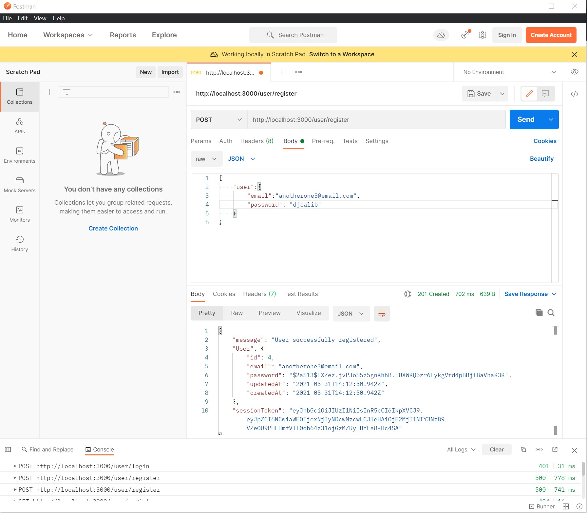
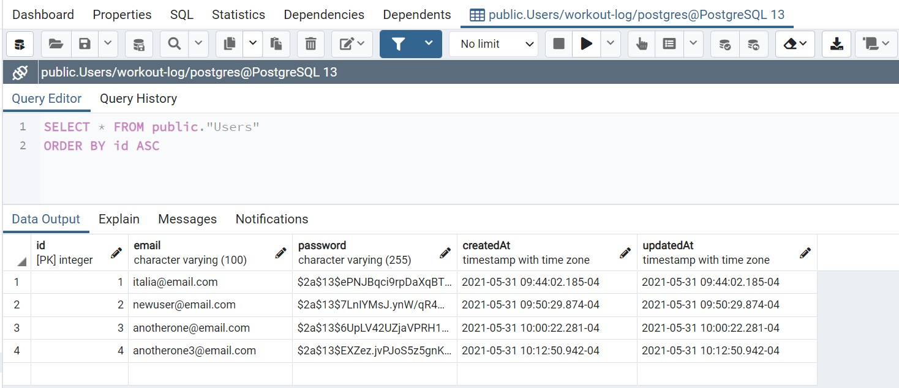
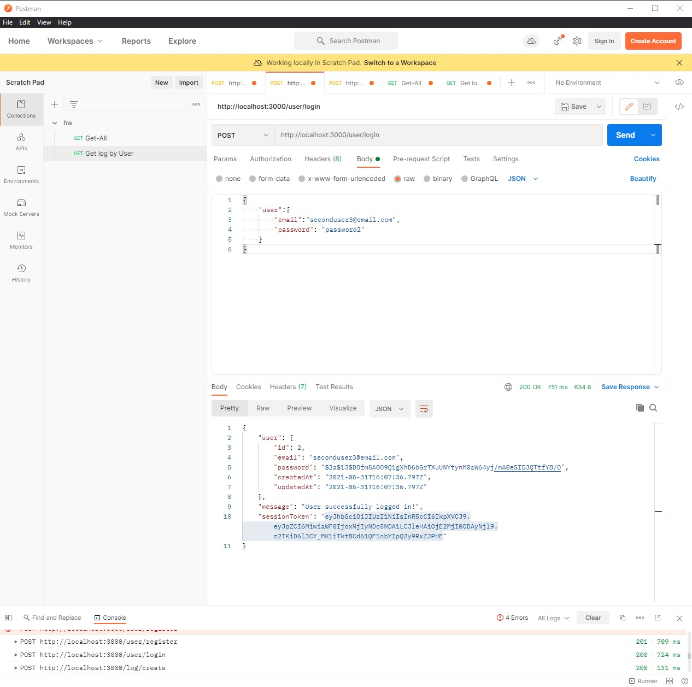
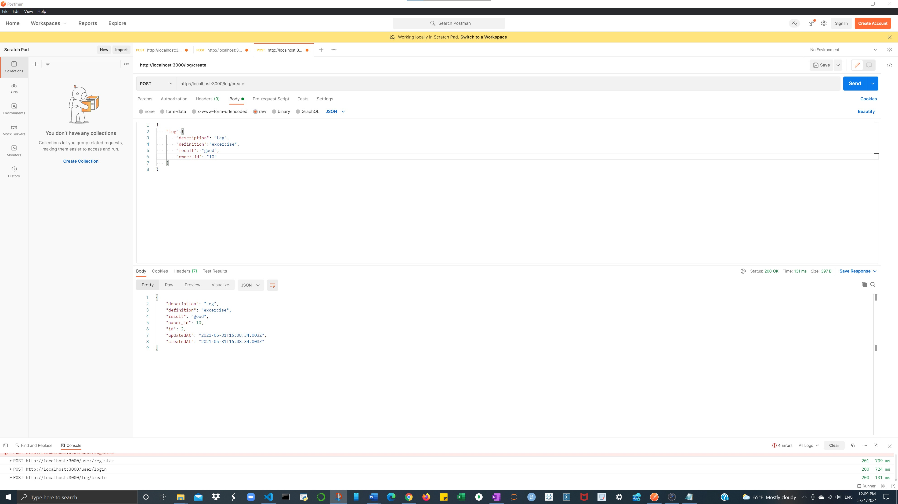
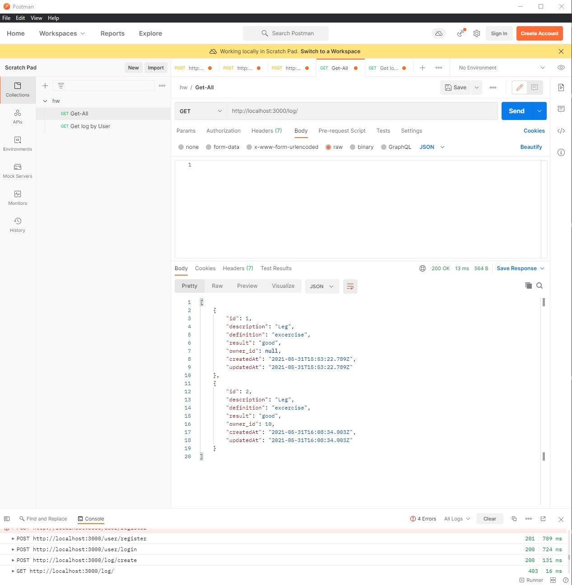
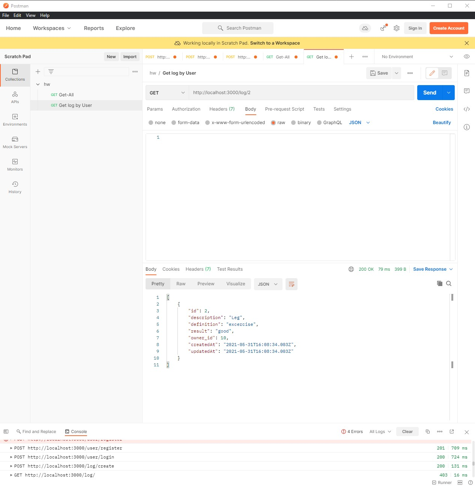

# workoutserver

Endpoint ""user/register" with verb "POST".

 

Endpoint ""user/login" with verb "POST".

 

Endpoint ""user/create" with verb "POST".

Endpoint ""user/log" with verb "POST".

Endpoint ""user/:id" with verb "POST".

